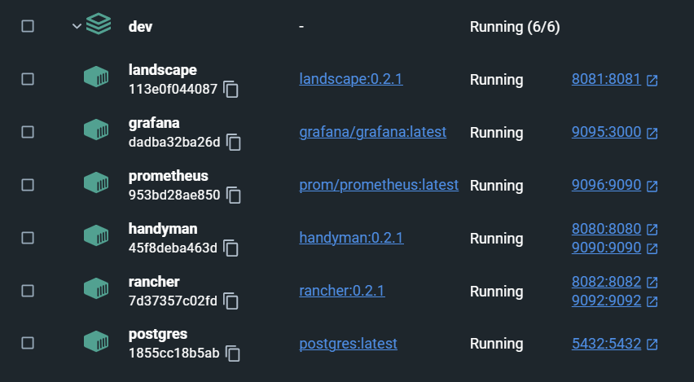

1. Для запуска необходимо прописать `docker-compose up -d`
2. Для повторного билда`docker-compose build --no-cache`

Скрипт для сборки находится здесь [тык](./docker-compose.yml)

Для запуска через minicube:

1. `minicube start`
2. `kubectl apply -f kube`
3. `minikube service $SERVICE`, где `SERVICE` это handyman, rancher или landscape
4. Для остановки использовать [скрипт](./kube/stop-all.sh)